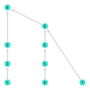
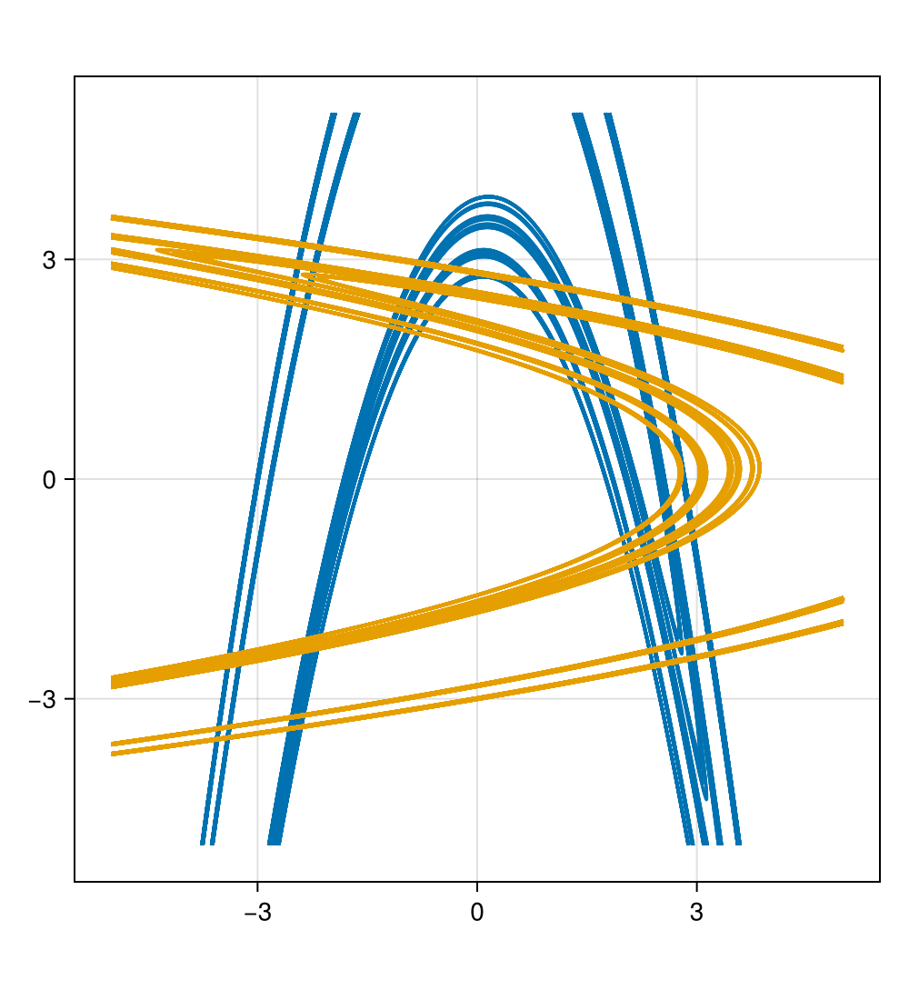
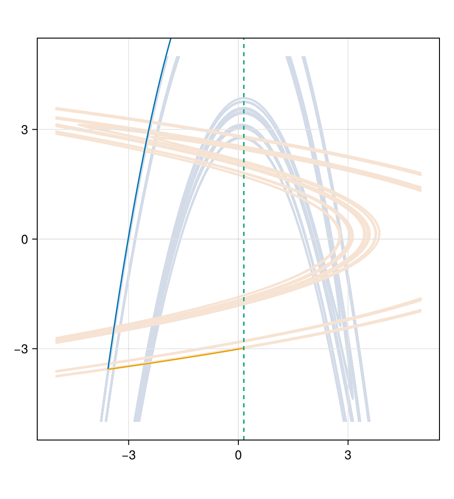
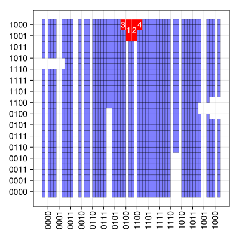

# ガイド

公開しているプログラムについて、簡単な説明と使用方法を記載します。

## BlockMaps.jl

## cascade-count.jl

フルシフト ``\Sigma_2 = \{1, 2\}^\mathbb{Z}`` の与えられた subshifts of finite type ``X`` に対して、``\Sigma_2 \setminus X`` における ``(2, n)``-cascade の数を計算するためのプログラムです。
Subshift of finite type は `1`, `2` と `"*"` をアルファベットとする有限個の forbidden words の配列で表されます。
ここで `"*"` は `1` と `2` のどちらかを表すワイルドカードで、例えば `(1, 2, "*", 1)` は `(1, 2, 1, 1)` と `(1, 2, 2, 1)` の両方を表します。

`cascade-count.jl` には ``2``-cascade の数を計算するための関数が3つ定義されています。

[`count_cascade`](@ref) は、与えられた subshift of finite type ``X`` に対して、``\Sigma_2 \setminus X`` における ``(2, n)``-cascade の数 ``c_n`` を次の漸化式を用いて計算します。

```math
    c_n = \frac{1}{2} \left(p_n - \sum_{\substack{n = 2^i\dot k, \\ i \ge 1}} c_k \right).
```

ここで、$p_n$ は ``\Sigma_2 \setminus X`` における周期 ``n`` の周期軌道の数を表しています。

[`gcd2_cascade`](@ref) は、与えられた subshift of finite type ``X`` に対して、``\Sigma_2 \setminus X`` における ``(2, n)``-cascade の数 ``c_n`` を $\gcd$ を用いた以下の式で計算します。

```math
    c_n = \frac{1}{2n} \sum_{d | n} \gcd(2, d) \mu\left(d\right) f_{n/d}.
```

ここで、``\mu`` は Möbius 関数、``f_{n/d}`` は ``\Sigma_2 \setminus X`` における ``\sigma^{n/d}`` の不動点の数を表しています。

[`even1_cascade`](@ref) は、与えられた subshift of finite type ``X`` に対して、``\Sigma_2 \setminus X`` における ``(2, n)``-cascade の数 ``c_n`` を、周期 ``n`` の周期軌道のうち `1` の数が偶数であるものの数を用いて計算します。

修士論文の内容から、これら3つの関数は全て同じ結果を返すことが分かります。

```@repl cascade-count
include("../../src/cascade-count.jl") # hide
count_cascade([(2, 1, "*", 2, 1)], 12)' # `'` is just for transpose
gcd2_cascade([(2, 1, "*", 2, 1)], 12)' # `'` is just for transpose
even1_cascade([(2, 1, "*", 2, 1)], 12)' # `'` is just for transpose
```

3つの関数は forbidden words を表す配列のほかに整数値 `m` を引数に取ります。
この `m` を元に、関数は `m` 以下の ``n`` に対する ``(2, n)``-cascade の数を計算して、ベクトルとして返します。
例えば、上の実行例では、``\Sigma_2 \setminus X`` における ``(2, n)``-cascade の数を、``n = 1, 2, ..., 12`` に対して計算しています。

``X`` の subshift of finite type ``Y`` に対して、``X \setminus Y`` における ``(2, n)``-cascade の数を計算するためには、``Y`` に対する計算結果から ``X`` に対する計算結果を引けば良いです。

```@repl cascade-count
X = [(2, 1, "*", 2, 1, 1)]
Y = [(2, 1, "*", 2, 1)]
count_cascade(Y, 12)' - count_cascade(X, 12)' # `'` is just for transpose
```

## subshift-lattice.jl

フルシフト ``\Sigma_2 = \{0, 1\}^\mathbb{Z}`` の与えられた subshifts of finite type の間の包含関係を計算するためのプログラムです。
このプログラムは、subshift of finite type を構成する forbidden words の集合を入力として受け取り、subshift of finite type の間の包含関係を計算します。
Subshift of finite type は、`0` と `1` をアルファベットとする有限個の forbidden words の配列で表されます。

```@repl subshift-lattice
include("../../src/subshift-lattice.jl") # hide
[ [1, 0, 1, 0, 0], [1, 1, 1, 0, 0] ] ⊏ [ [0, 1, 0, 1, 0, 0], [0, 1, 1, 1, 0, 0] ]
[ [1, 0, 1, 0, 0], [1, 1, 1, 0, 0] ] ⊐ [ [0, 1, 0, 1, 0, 0], [0, 1, 1, 1, 0, 0] ]
```

また、`shift_hasse_diagram` 関数を使うことで、与えられた subshifts of finite type の集合に対して、包含関係を表す Hasse diagram を描画することができます。

```@figure subshift-lattice
shift_hasse_diagram([
    [ [1, 0, 1, 0, 0], [1, 1, 1, 0, 0] ],
    [ [0, 1, 0, 1, 0, 0], [0, 1, 1, 1, 0, 0] ],
    [ [0, 0, 1, 0, 1, 0, 0], [0, 0, 1, 1, 1, 0, 0] ],
    [
        [0, 0, 1, 0], [0, 1, 1, 0],
        [1, 0, 0, 1, 1, 1], [1, 0, 1, 1, 1, 1],
    ],
    [ 
        [0, 0, 1, 0], [0, 1, 1, 0],
        [1, 1, 0, 0, 1, 1, 1, 0], [1, 1, 0, 1, 1, 1, 1, 0],
    ],
    [ [0, 0, 1, 0], [0, 1, 1, 0] ],
    [
        [1, 0, 0, 1, 0], [1, 0, 1, 1, 0],
        [0, 0, 0, 0, 1, 0], [0, 0, 0, 1, 1, 0],
        [1, 0, 0, 1, 1, 1], [1, 0, 1, 1, 1, 1],
    ],
    [ [1, 0, 0, 1, 0], [1, 0, 1, 1, 0] ],
    Word[] #full shift (`Word` is an alias for `Vector{Int}`)
])
```



数字は、与えられた subshifts of finite type の集合におけるインデックスを表しています。
例えば上の実行例において、フルシフトのインデックスは `9` であり、`1` から `8` までの全ての頂点が `9` へのパスを持っています。
よって、フルシフトは全ての subshift of finite type を包含していることがわかります。

## Pruning.jl

Hagiwara と Shudo [^HS] によって提案された、保存系の実 Hénon 写像の primary pruned region を推定するアルゴリズムを Julia で実装したものです。
実 Hénon 写像の横断的なホモクリニック点を計算し、それらをフルシフト ``\Sigma_2`` の点に対応させることで、pruned words を推定します。
このアルゴリズムを使うことで、与えられた実 Hénon 写像に対応する subshift of finite type を推定することができます。
Primary pruned region の完全な決定には全ての横断的なホモクリニック点を計算する必要があるため、得られる結果はあくまで推定であることに注意してください。

`Pruning.jl` では以下のワークフローでアルゴリズムを実行します。

### 1. 実 Hénon 写像の指定

`Pruning.jl` では、実 Hénon 写像を以下の形式で指定します。

```jldoctest pruning
julia> include("../src/Pruning.jl")
markerize

julia> hm = HenonMap(5.59, -1)
HenonMap(5.59, -1.0)
```

[`HenonMap(a, b)`](@ref) は2つのパラメータを取る構造体で、以下の写像 ``H_{c, a}: \mathbb{R}^2 \to \mathbb{R}^2`` を定義します。

```math
H_{c, a}(x, y) = (-x^2 + b y + a,\ x).
```

### 2. ホモクリニック点の計算

実 Hénon 写像の横断的なホモクリニック点を計算するために、不動点の安定多様体と不安定多様体を数値的に計算します。

まず、[`hyperbolic_fixed_points`](@ref) 関数を使って双曲的な不動点を計算します。

```jldoctest pruning
julia> hyperbolic_fixed_points(hm)
2-element Vector{Any}:
 [1.567099530598687, 1.567099530598687]
 [-3.567099530598687, -3.567099530598687]

julia> fixpt = hyperbolic_fixed_points(hm)[2]
2-element Point{2, Float64} with indices SOneTo(2):
 -3.567099530598687
 -3.567099530598687
```

次に、[`manifolds`](@ref) 関数を使って、不動点の安定多様体と不安定多様体を計算します。
[`manifolds`](@ref) 関数は、与えられた実 Hénon 写像と双曲的な不動点から、それらの安定多様体と不安定多様体のペアを返します。
`num_iterations` 引数を指定することで、多様体の計算に使用するイテレーションの回数を指定することができます。
イテレーション回数が多いほど、多様体のセグメントの数が増え、より詳細な多様体の形状を得ることができますが、今後の処理も含めて計算時間も長くなります。

```jldoctest pruning
julia> smfds, umfds = manifolds(hm, fixed_pt=fixpt, num_iterations=13);
```

安定多様体を愚直に計算した場合、座標の値が非常に大きくなってしまうため、通常は ``[-5, 5] \times [-5, 5]`` の範囲に収まるように、その範囲を出た部分を取り除きながら計算します。
そのため、戻り値として得られるものは、多様体の __セグメントの配列__ になります。
したがって、smfds と umfds を適切プロットすると、以下のように ``[-5, 5] \times [-5, 5]`` の範囲で切り取られた曲線のあつまりが描画されます[^plot_manifolds]。

[^plot_manifolds]: プロットの詳細は `src/examples/pruning.jl` にある `plot_manifold` を参照。



その後、安定多様体と不安定多様体の交点を計算することで、横断的なホモクリニック点を得ることができます。
曲線の交点の計算には [`intersections`](@ref) 関数を使用します。

```jldoctest pruning
julia> homoclinic_pts = intersections(smfds, umfds);
```

[`intersections`](@ref) は戻り値として `Tuple{Int, Int, Int, Int, Point2}` の配列を返します。

- 最初の整数は、交点が一つ目の引数の何番目のセグメント上にあるかを表します
- 二番目の整数は、交点がセグメント上の何番目の点と点の間にあるかを表します
- 三番目の整数は、交点が二つ目の引数の何番目のセグメント上にあるかを表します
- 四番目の整数は、交点がセグメント上の何番目の点と点の間にあるかを表します
- 最後の `Point2` は、交点の座標を表します

`Pruning.jl` では、座標は `GeometryBasics.jl` の `Point2` 構造体で表現されます。

```jldoctest pruning
julia> homoclinic_pts[1]
(1, 1, 39, 12891, [-3.5670276274859902, -3.5665968536124044])

julia> homoclinic_pts[1][5]
2-element Point{2, Float64} with indices SOneTo(2):
 -3.5670276274859902
 -3.5665968536124044
```

以降のステップでは、`Point2` の座標のみを使用するため、`homoclinic_pts` の各要素の最後の `Point2` を取り出して、横断的なホモクリニック点の座標の配列を作成します。

```jldoctest pruning
julia> homoclinic_pts_coords = [info[5] for info in homoclinic_pts];
```

### 3. ホモクリニック点の符号化

[2. ホモクリニック点の計算](@ref) で得られた横断的なホモクリニック点を、``\Sigma_2`` の点に対応させ符号化します。
ホモクリニック点を符号化するために、関数 `partition` を定義します。

```jldoctest pruning
julia> partition(pt::Point2o) = pt[1] < 0.15 ? 0 : 1
partition (generic function with 1 method)
```

`partition` 関数は、`Point2o` 型の点を引数にとり、`0` または `1` を返す関数である必要があります。
また、`partition` 関数の不動点における値は `0` でなければなりません。
今回は、点の x 座標が `0.15` より小さい場合は `0` を返し、そうでない場合は `1` を返すように定義しています。

符号化には __primary branch__ の情報も必要になります。
Primary branch は安定多様体/不安定多様体を不動点から `partition` の値が変わるまでの部分を切り取ったセグメントとして定義されます。
[`primary_branch`](@ref) 関数を使って、stable primary branch および unstable primary branch を計算します。

```jldoctest pruning
julia> prim_sb, prim_ub = primary_branch(hm, partition, fixed_pt=fixpt);
```



ホモクリニック点の配列と `partition` 関数、primary branch の情報を [`symbolic_encoding`](@ref) 関数に渡して、ホモクリニック点の符号化を行います。
[`symbolic_encoding`](@ref) に `iter` 引数を渡すことで、符号化の長さを指定することができます (デフォルト値は`15`)。
実装上、`iter` 引数に指定する値は、[2. ホモクリニック点の計算](@ref) で `manifolds` 関数に渡したイテレーション回数 `num_iterations` と同じか小さい値を指定すれば十分です。

```jldoctest pruning
julia> symb_codes = symbolic_encoding(hm, homoclinic_pts_coords, partition, prim_sb, prim_ub, iter=13);

julia> symb_codes[1]
19-element HomoclinicCode:
(0ᵒᵒ)100000.0000000000001(0ᵒᵒ)
```

[`symbolic_encoding`](@ref) は、入力されたホモクリニック点の配列を符号化して、[`HomoclinicCode`](@ref) 型の配列を返します。
[`HomoclinicCode`](@ref) は、最終的に `0` を取り続ける整数による両側無限列を表す構造体です。
例えば、上の例では、`symb_codes[1]` は、両側無限列 ``0^{\infty}100000.00000000000010^{\infty}`` を表しています。
`0` を取り続ける部分は、`(0ᵒᵒ)` として表されます。
[`HomoclinicCode`](@ref) のインスタンスは両側無限列であるため、いくらでも大きいインデックスに対して値を取り出すことができます。

```jldoctest pruning
julia> code = HomoclinicCode("10.101")
5-element HomoclinicCode:
(0ᵒᵒ)10.101(0ᵒᵒ)

julia> code[-2:2]
5-element Vector{Int64}:
 1
 0
 1
 0
 1

julia> code[10000]
0
```

### 4. Primary pruned region の推定

[3. ホモクリニック点の符号化](@ref) で得られたホモクリニック点の符号化を使って、primary pruned region を推定します。

Primary pruned region の推定には、[`primary_pruning_front`](@ref) 関数を使用します。
この関数は、ホモクリニック点の符号化を引数にとり、primary pruned region を構成するブロックの配列を返します。
ブロックは、4つのホモクリニックコードのタプルで表されます。
例えば、以下のような出力が得られます。

```jldoctest pruning
julia> blocks = primary_pruning_front(symb_codes)
4-element Vector{NTuple{4, HomoclinicCode}}:
 (HomoclinicCode(1.01), HomoclinicCode(1001.01), HomoclinicCode(1001.010001), HomoclinicCode(1.010001))
 (HomoclinicCode(1.11), HomoclinicCode(1001.11), HomoclinicCode(1001.110001), HomoclinicCode(1.110001))
 (HomoclinicCode(1.010011), HomoclinicCode(10001.010011), HomoclinicCode(10001.01001), HomoclinicCode(1.01001))
 (HomoclinicCode(1.110011), HomoclinicCode(10001.110011), HomoclinicCode(10001.11001), HomoclinicCode(1.11001))
```

上記の例では、primary pruned region を構成するブロックが4つあることがわかります。
ブロックの各要素は、symbolic plane において primary pruned region を構成するブロックの頂点を表しています。

これまでのステップで得られたホモクリニック点の符号化 `symb_codes` とprimary pruned region のブロック `blocks` を symbolic plane にプロットすると、以下のようになります[^plot_pruned_region]。

[^plot_pruned_region]: プロットの詳細は `src/examples/pruning.jl` にある `plot_primary_pruned_region` を参照。



青い長方形は `symb_codes` に対応する symbolic plane 上の点を表しています。
赤い多角形は `blocks` に対応する symbolic plane 上のブロックを表しています。
赤い長方形に書かれた数字は `blocks` におけるブロックのインデックスを表しています。
横軸が未来方向の符号、縦軸が過去方向の符号を表しています。
例えば、縦軸が左から `1000.`、横軸が上から `.1011` の部分には、青い長方形が存在しているため、今回の Hénon map は `0^\infty 1000.1011 0^\infty` に対応するホモクリニック点を持つことがわかります。

[`forbidden_words`](@ref) 関数を使うことで、primary pruned region を構成するブロックに対応する forbidden words を得ることができます。

```jldoctest pruning
julia> forbidden_words(blocks)
4-element Vector{String}:
 "00101000"
 "00111000"
 "000101001"
 "000111001"
```

さらに、[`markerize`](@ref) 関数を使うことで、得られた forbidden words を markerize することができます。

```jldoctest pruning
julia> markerize(forbidden_words(blocks))
2-element Vector{String}:
 "0001X1001"
 "001X1000"
```

!!! note "エラーの対処"
    [`primary_pruning_front`](@ref) に渡すホモクリニック点の数が足りない場合、エラーが発生します。

    ```jldoctest pruning
    julia> primary_pruning_front(symb_codes[1:10])
    ERROR: cannot apply Ns to a code with less than 2 backward symbols
    [...]
    ```

    この場合は、前節の [`manifolds`](@ref) における計算のイテレーション回数 `num_iterations` や [`symbolic_encoding`](@ref) におけるイテレーション回数 `iter` を増やして、より多くのホモクリニック点を得るようにしてください。

[^HS]: R. Hagiwara and A. Shudo. *An algorithm to prune the area-preserving Hénon map*. Journal of Physics. A. Mathematical and General, __37__ (2004), no. 44, 10521–10543.
